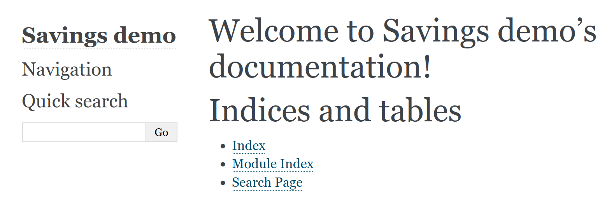

<script type="text/javascript"
  src="https://cdn.mathjax.org/mathjax/latest/MathJax.js?config=TeX-AMS-MML_HTMLorMML">
</script>
# Packaging and documentation

CB2060 Applied programming for life sciences

KTH

---
layout: false

## Goal


## Preparing your package for pypi

A simple tool: flit

* Install flit in your virtual environment

```
(myenv) $ pip install flit
```

Three steps

1. flit init
2. flit build
3. flit publish

---

## init

~~~
$ flit init
~~~

* Answer questions
* generates standars License file
* a `pyproject.toml` file - meta-data about your project

---

## build

~~~
$ flit build
~~~

* Creates a dist subfolder
    - a compressed archive of your source
    - a "wheel", a standardised (binary) zip file with metadata


---
## install

~~~
$ flit install
~~~

* Installs as a package in the local environment
    - typically under `...venv.../lib/python3.8/site-packages`
    - a `--symlink` option will link back to source directory


---

## publish

~~~
$ flit publish
~~~

...and it is available to anyone

---

## Readthedocs/sphinx

* A standard for documenting Python programs
* Documentation published at project.readthedocs.io
* Sphinx tool for generating docs


---

## Initialize

~~~
$ source venv/bin/activate
$ (venv) pip install sphinx
$ (venv) mkdir docs
$ (venv) cd docs
$ (venv) sphinx-quickstart
~~~


Files generated

~~~
docs
├── _build
├── conf.py   (configuration)
├── index.rst (main document)
├── make.bat
├── Makefile
├── _static
└── _templates
~~~

---
 Generate html

~~~
$ make html
...
The HTML pages are in _build/html.
~~~



~~~
$ pip install sphinx-rtd-theme
#conf.py
theme =  'sphinx_rtd_theme'
~~~


---

## Extract source documentation

~~~
extensions = ['sphinx.ext.autodoc']
~~~


~~~
$ sphinx-apidoc -o . ..
Creating file ./savings.rst.
Creating file ./modules.rst.
~~~


